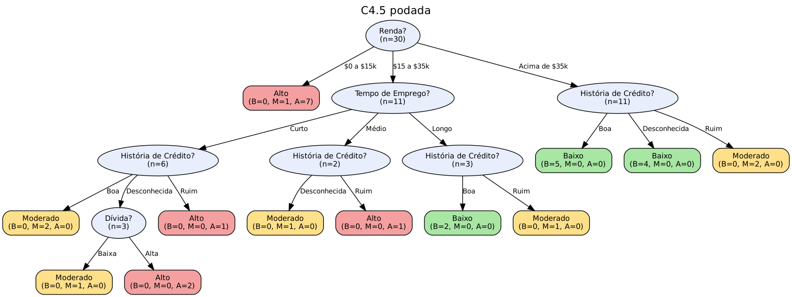
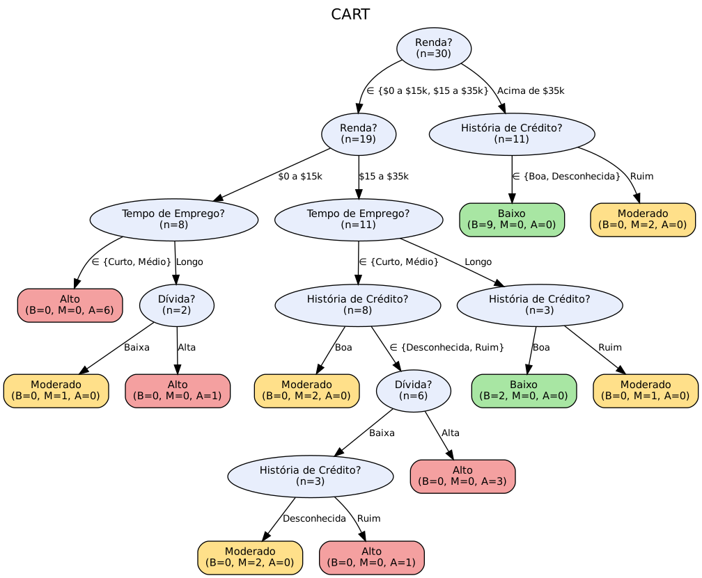

# Questão 1 — Árvores de decisão construídas "à mão" (ID3, C4.5 e CART)

> Todos os números deste relatório são **gerados por código** (`python -m q1.executar`); nada foi digitado à mão.
> O passo a passo completo (todos os nós, todos os atributos, todas as partições) está em
> [`resultados/passo_a_passo_id3.md`](resultados/passo_a_passo_id3.md),
> [`resultados/passo_a_passo_c45.md`](resultados/passo_a_passo_c45.md) e
> [`resultados/passo_a_passo_cart.md`](resultados/passo_a_passo_cart.md).

## (i) Ampliação da base para 6 atributos e 30 exemplos

A base original do "gerente do banco" (baseada em Luger) tem 14 exemplos e 4 atributos (História de Crédito, Dívida,
Garantia, Renda) com a classe **Risco** ∈ {Baixo, Moderado, Alto}. (No enunciado, o exemplo E13 aparece como "baixo" em
minúsculas; foi normalizado para **Baixo**.)

**Novos atributos (2):**

| Atributo | Valores | Motivação |
|---|---|---|
| Tempo de Emprego | Curto (< 1 ano), Médio (1 a 5 anos), Longo (> 5 anos) | estabilidade da renda: quem tem emprego longo costuma ter menor risco |
| Residência | Alugada, Própria | patrimônio/estabilidade: imóvel próprio atenua o risco |

**Novos exemplos (16: E15 a E30):** 5 de risco Alto, 5 Moderado e 6 Baixo, de modo que a base final
tem 30 exemplos com distribuição **Baixo: 11, Moderado: 8, Alto: 11**. Os valores dos dois novos atributos também foram atribuídos
aos 14 exemplos originais (sem alterar nenhum dos valores originais nem as classes).

Os exemplos adicionados são **fictícios**, criados seguindo uma "política" plausível do gerente, para que as árvores tenham
estrutura interessante e não degenerem: (1) renda baixa leva a risco Alto, salvo exceções com garantia/emprego longo;
(2) renda média depende do histórico e da dívida, e emprego longo com residência própria "rebaixa" o risco em um nível;
(3) renda alta leva a risco Baixo, exceto histórico Ruim (Moderado). Verificou-se que **não há exemplos conflitantes**
(mesmos valores de atributos com classes diferentes).

| ID | História de Crédito | Dívida | Garantia | Renda | Tempo de Emprego | Residência | Risco |
| --- | --- | --- | --- | --- | --- | --- | --- |
| E1 | Ruim | Alta | Nenhuma | $0 a $15k | Curto | Alugada | **Alto** |
| E2 | Desconhecida | Alta | Nenhuma | $15 a $35k | Curto | Alugada | **Alto** |
| E3 | Desconhecida | Baixa | Nenhuma | $15 a $35k | Médio | Própria | **Moderado** |
| E4 | Desconhecida | Baixa | Nenhuma | $0 a $15k | Médio | Alugada | **Alto** |
| E5 | Desconhecida | Baixa | Nenhuma | Acima de $35k | Longo | Própria | **Baixo** |
| E6 | Desconhecida | Baixa | Adequada | Acima de $35k | Médio | Alugada | **Baixo** |
| E7 | Ruim | Baixa | Nenhuma | $0 a $15k | Curto | Alugada | **Alto** |
| E8 | Ruim | Baixa | Adequada | Acima de $35k | Médio | Própria | **Moderado** |
| E9 | Boa | Baixa | Nenhuma | Acima de $35k | Longo | Própria | **Baixo** |
| E10 | Boa | Alta | Adequada | Acima de $35k | Médio | Alugada | **Baixo** |
| E11 | Boa | Alta | Nenhuma | $0 a $15k | Curto | Alugada | **Alto** |
| E12 | Boa | Alta | Nenhuma | $15 a $35k | Curto | Alugada | **Moderado** |
| E13 | Boa | Alta | Nenhuma | Acima de $35k | Médio | Própria | **Baixo** |
| E14 | Ruim | Alta | Nenhuma | $15 a $35k | Médio | Alugada | **Alto** |
| E15 | Ruim | Baixa | Nenhuma | $15 a $35k | Curto | Alugada | **Alto** |
| E16 | Desconhecida | Alta | Adequada | $15 a $35k | Curto | Própria | **Alto** |
| E17 | Boa | Alta | Nenhuma | $0 a $15k | Longo | Própria | **Alto** |
| E18 | Ruim | Baixa | Adequada | $0 a $15k | Curto | Alugada | **Alto** |
| E19 | Desconhecida | Baixa | Adequada | $0 a $15k | Médio | Alugada | **Alto** |
| E20 | Ruim | Alta | Nenhuma | $15 a $35k | Longo | Própria | **Moderado** |
| E21 | Desconhecida | Baixa | Adequada | $15 a $35k | Curto | Alugada | **Moderado** |
| E22 | Boa | Alta | Nenhuma | $15 a $35k | Curto | Alugada | **Moderado** |
| E23 | Ruim | Alta | Adequada | Acima de $35k | Médio | Própria | **Moderado** |
| E24 | Boa | Baixa | Adequada | $0 a $15k | Longo | Própria | **Moderado** |
| E25 | Boa | Baixa | Adequada | $15 a $35k | Longo | Própria | **Baixo** |
| E26 | Boa | Baixa | Nenhuma | $15 a $35k | Longo | Própria | **Baixo** |
| E27 | Desconhecida | Alta | Nenhuma | Acima de $35k | Médio | Alugada | **Baixo** |
| E28 | Boa | Baixa | Nenhuma | Acima de $35k | Curto | Alugada | **Baixo** |
| E29 | Desconhecida | Baixa | Adequada | Acima de $35k | Longo | Própria | **Baixo** |
| E30 | Boa | Alta | Adequada | Acima de $35k | Médio | Própria | **Baixo** |

Arquivo: [`dados/credito_ampliado.csv`](dados/credito_ampliado.csv).

## (ii) Construção das três árvores

### Fórmulas usadas

* Entropia: H(S) = − Σ pᵢ·log₂ pᵢ  ·  Ganho(S, A) = H(S) − Σ (|S_v|/|S|)·H(S_v)
* Informação da divisão: InfoDivisão(A) = − Σ (|S_v|/|S|)·log₂(|S_v|/|S|)  ·  Razão de ganho = Ganho / InfoDivisão
* Gini: G(S) = 1 − Σ pᵢ²  ·  Gini ponderado de uma divisão binária = (n_esq/n)·G_esq + (n_dir/n)·G_dir

| Algoritmo | Critério | Tipo de divisão | Poda |
|---|---|---|---|
| ID3 | maior **ganho de informação** | multivalorada (um ramo por valor) | não |
| C4.5 | maior **razão de ganho**, entre os atributos com ganho ≥ ganho médio | multivalorada | pessimista (CF = 25 %) |
| CART | menor **Gini ponderado** | **sempre binária** (subconjunto de valores vs. resto) | não (ver discussão) |

Empates de critério são desfeitos pela ordem das colunas da base; a classe de uma folha não pura é a maioria (empate →
classe mais grave). Ramos só são criados para valores observados no nó.

### ID3

#### Nó raiz (nó 1) — cálculos completos

Exemplos (30): E1, E2, E3, E4, E5, E6, E7, E8, E9, E10, E11, E12, E13, E14, E15, E16, E17, E18, E19, E20, E21, E22, E23, E24, E25, E26, E27, E28, E29, E30  
Distribuição: B=11, M=8, A=11  
H(S) = − (11/30)·log₂(11/30) − (8/30)·log₂(8/30) − (11/30)·log₂(11/30) = 1,5700

| Atributo | Divisão (valor → B, M, A ; H) | H(S∣A) | Ganho |
| --- | --- | --- | --- |
| História de Crédito | Boa → B=7, M=3, A=2 ; H=1,384<br>Desconhecida → B=4, M=2, A=4 ; H=1,522<br>Ruim → B=0, M=3, A=5 ; H=0,954 | 1,3156 | 0,2544 |
| Dívida | Baixa → B=7, M=4, A=5 ; H=1,546<br>Alta → B=4, M=4, A=6 ; H=1,557 | 1,5511 | 0,0189 |
| Garantia | Nenhuma → B=6, M=4, A=8 ; H=1,530<br>Adequada → B=5, M=4, A=3 ; H=1,555 | 1,5401 | 0,0298 |
| Renda | $0 a $15k → B=0, M=1, A=7 ; H=0,544<br>$15 a $35k → B=2, M=5, A=4 ; H=1,495<br>Acima de $35k → B=9, M=2, A=0 ; H=0,684 | 0,9439 | 0,6261 |
| Tempo de Emprego | Curto → B=1, M=3, A=7 ; H=1,241<br>Médio → B=5, M=3, A=3 ; H=1,539<br>Longo → B=5, M=2, A=1 ; H=1,299 | 1,3657 | 0,2042 |
| Residência | Alugada → B=4, M=3, A=9 ; H=1,420<br>Própria → B=7, M=5, A=2 ; H=1,432 | 1,4253 | 0,1447 |

Cálculos detalhados (todos os atributos, nó raiz):

- Ganho(História de Crédito) = 1,5700 − [(12/30)·1,3844 + (10/30)·1,5219 + (8/30)·0,9544] = 1,5700 − 1,3156 = **0,2544**
- Ganho(Dívida) = 1,5700 − [(16/30)·1,5462 + (14/30)·1,5567] = 1,5700 − 1,5511 = **0,0189**
- Ganho(Garantia) = 1,5700 − [(18/30)·1,5305 + (12/30)·1,5546] = 1,5700 − 1,5401 = **0,0298**
- Ganho(Renda) = 1,5700 − [(8/30)·0,5436 + (11/30)·1,4949 + (11/30)·0,6840] = 1,5700 − 0,9439 = **0,6261**
- Ganho(Tempo de Emprego) = 1,5700 − [(11/30)·1,2407 + (11/30)·1,5395 + (8/30)·1,2988] = 1,5700 − 1,3657 = **0,2042**
- Ganho(Residência) = 1,5700 − [(16/30)·1,4197 + (14/30)·1,4316] = 1,5700 − 1,4253 = **0,1447**

➡ **Atributo escolhido: Renda** (maior ganho de informação).


Decisões em todos os nós:

| Nó | Caminho | n | Distribuição | Atributo | Critério | Obs. |
| --- | --- | --- | --- | --- | --- | --- |
| 1 | (raiz) | 30 | B=11, M=8, A=11 | **Renda** | ganho = 0,6261 |  |
| 2 | Renda = $0 a $15k | 8 | B=0, M=1, A=7 | **Tempo de Emprego** | ganho = 0,2936 | empate com Residência |
| 5 | Renda = $0 a $15k E Tempo de Emprego = Longo | 2 | B=0, M=1, A=1 | **Dívida** | ganho = 1,0000 | empate com Garantia |
| 8 | Renda = $15 a $35k | 11 | B=2, M=5, A=4 | **História de Crédito** | ganho = 0,5172 | empate com Tempo de Emprego |
| 9 | Renda = $15 a $35k E História de Crédito = Boa | 4 | B=2, M=2, A=0 | **Dívida** | ganho = 1,0000 | empate com Tempo de Emprego, Residência |
| 12 | Renda = $15 a $35k E História de Crédito = Desconhecida | 4 | B=0, M=2, A=2 | **Dívida** | ganho = 1,0000 |  |
| 15 | Renda = $15 a $35k E História de Crédito = Ruim | 3 | B=0, M=1, A=2 | **Tempo de Emprego** | ganho = 0,9183 | empate com Residência |
| 19 | Renda = Acima de $35k | 11 | B=9, M=2, A=0 | **História de Crédito** | ganho = 0,6840 |  |


```
├─ Renda = $0 a $15k
│  ├─ Tempo de Emprego = Curto  ──►  Alto  [B=0, M=0, A=4]
│  ├─ Tempo de Emprego = Médio  ──►  Alto  [B=0, M=0, A=2]
│  └─ Tempo de Emprego = Longo
│     ├─ Dívida = Baixa  ──►  Moderado  [B=0, M=1, A=0]
│     └─ Dívida = Alta  ──►  Alto  [B=0, M=0, A=1]
├─ Renda = $15 a $35k
│  ├─ História de Crédito = Boa
│  │  ├─ Dívida = Baixa  ──►  Baixo  [B=2, M=0, A=0]
│  │  └─ Dívida = Alta  ──►  Moderado  [B=0, M=2, A=0]
│  ├─ História de Crédito = Desconhecida
│  │  ├─ Dívida = Baixa  ──►  Moderado  [B=0, M=2, A=0]
│  │  └─ Dívida = Alta  ──►  Alto  [B=0, M=0, A=2]
│  └─ História de Crédito = Ruim
│     ├─ Tempo de Emprego = Curto  ──►  Alto  [B=0, M=0, A=1]
│     ├─ Tempo de Emprego = Médio  ──►  Alto  [B=0, M=0, A=1]
│     └─ Tempo de Emprego = Longo  ──►  Moderado  [B=0, M=1, A=0]
└─ Renda = Acima de $35k
   ├─ História de Crédito = Boa  ──►  Baixo  [B=5, M=0, A=0]
   ├─ História de Crédito = Desconhecida  ──►  Baixo  [B=4, M=0, A=0]
   └─ História de Crédito = Ruim  ──►  Moderado  [B=0, M=2, A=0]
```

### C4.5

#### Nó raiz (nó 1) — cálculos completos

Exemplos (30): E1, E2, E3, E4, E5, E6, E7, E8, E9, E10, E11, E12, E13, E14, E15, E16, E17, E18, E19, E20, E21, E22, E23, E24, E25, E26, E27, E28, E29, E30  
Distribuição: B=11, M=8, A=11  
H(S) = − (11/30)·log₂(11/30) − (8/30)·log₂(8/30) − (11/30)·log₂(11/30) = 1,5700

| Atributo | Divisão (valor → B, M, A ; H) | H(S∣A) | Ganho | InfoDivisão | Razão de ganho | Ganho ≥ média? |
| --- | --- | --- | --- | --- | --- | --- |
| História de Crédito | Boa → B=7, M=3, A=2 ; H=1,384<br>Desconhecida → B=4, M=2, A=4 ; H=1,522<br>Ruim → B=0, M=3, A=5 ; H=0,954 | 1,3156 | 0,2544 | 1,5656 | 0,1625 | sim |
| Dívida | Baixa → B=7, M=4, A=5 ; H=1,546<br>Alta → B=4, M=4, A=6 ; H=1,557 | 1,5511 | 0,0189 | 0,9968 | 0,0190 | não |
| Garantia | Nenhuma → B=6, M=4, A=8 ; H=1,530<br>Adequada → B=5, M=4, A=3 ; H=1,555 | 1,5401 | 0,0298 | 0,9710 | 0,0307 | não |
| Renda | $0 a $15k → B=0, M=1, A=7 ; H=0,544<br>$15 a $35k → B=2, M=5, A=4 ; H=1,495<br>Acima de $35k → B=9, M=2, A=0 ; H=0,684 | 0,9439 | 0,6261 | 1,5700 | 0,3988 | sim |
| Tempo de Emprego | Curto → B=1, M=3, A=7 ; H=1,241<br>Médio → B=5, M=3, A=3 ; H=1,539<br>Longo → B=5, M=2, A=1 ; H=1,299 | 1,3657 | 0,2042 | 1,5700 | 0,1301 | não |
| Residência | Alugada → B=4, M=3, A=9 ; H=1,420<br>Própria → B=7, M=5, A=2 ; H=1,432 | 1,4253 | 0,1447 | 0,9968 | 0,1452 | não |

Ganho médio dos candidatos = 0,2130. Só concorrem os atributos com ganho ≥ média; entre eles vence a maior **razão de ganho**.

Cálculos detalhados (todos os atributos, nó raiz):

- Ganho(História de Crédito) = 1,5700 − [(12/30)·1,3844 + (10/30)·1,5219 + (8/30)·0,9544] = 1,5700 − 1,3156 = **0,2544**
  - InfoDivisão(História de Crédito) = − (12/30)·log₂(12/30) − (10/30)·log₂(10/30) − (8/30)·log₂(8/30) = 1,5656; RazãoGanho = 0,2544 / 1,5656 = **0,1625**
- Ganho(Dívida) = 1,5700 − [(16/30)·1,5462 + (14/30)·1,5567] = 1,5700 − 1,5511 = **0,0189**
  - InfoDivisão(Dívida) = − (16/30)·log₂(16/30) − (14/30)·log₂(14/30) = 0,9968; RazãoGanho = 0,0189 / 0,9968 = **0,0190**
- Ganho(Garantia) = 1,5700 − [(18/30)·1,5305 + (12/30)·1,5546] = 1,5700 − 1,5401 = **0,0298**
  - InfoDivisão(Garantia) = − (18/30)·log₂(18/30) − (12/30)·log₂(12/30) = 0,9710; RazãoGanho = 0,0298 / 0,9710 = **0,0307**
- Ganho(Renda) = 1,5700 − [(8/30)·0,5436 + (11/30)·1,4949 + (11/30)·0,6840] = 1,5700 − 0,9439 = **0,6261**
  - InfoDivisão(Renda) = − (8/30)·log₂(8/30) − (11/30)·log₂(11/30) − (11/30)·log₂(11/30) = 1,5700; RazãoGanho = 0,6261 / 1,5700 = **0,3988**
- Ganho(Tempo de Emprego) = 1,5700 − [(11/30)·1,2407 + (11/30)·1,5395 + (8/30)·1,2988] = 1,5700 − 1,3657 = **0,2042**
  - InfoDivisão(Tempo de Emprego) = − (11/30)·log₂(11/30) − (11/30)·log₂(11/30) − (8/30)·log₂(8/30) = 1,5700; RazãoGanho = 0,2042 / 1,5700 = **0,1301**
- Ganho(Residência) = 1,5700 − [(16/30)·1,4197 + (14/30)·1,4316] = 1,5700 − 1,4253 = **0,1447**
  - InfoDivisão(Residência) = − (16/30)·log₂(16/30) − (14/30)·log₂(14/30) = 0,9968; RazãoGanho = 0,1447 / 0,9968 = **0,1452**

➡ **Atributo escolhido: Renda** (maior razão de ganho).


**Diferença em relação ao ID3 (nó 2, Renda = $0 a $15k).** Os atributos *Tempo de Emprego* e *Residência* empatam em ganho
de informação (0,2936); o ID3 desempata
pela ordem das colunas e escolhe *Tempo de Emprego*. O C4.5 usa a razão de ganho, que penaliza atributos com mais valores
(*Tempo de Emprego* tem 3 valores, razão = 0,1957;
*Residência* tem 2, razão = 0,3619) e escolhe
*Residência*. É exatamente o viés do ID3 por atributos multivalorados que o C4.5 corrige.

Decisões em todos os nós:

| Nó | Caminho | n | Distribuição | Atributo | Critério | Obs. |
| --- | --- | --- | --- | --- | --- | --- |
| 1 | (raiz) | 30 | B=11, M=8, A=11 | **Renda** | razão de ganho = 0,3988 (ganho = 0,6261) |  |
| 2 | Renda = $0 a $15k | 8 | B=0, M=1, A=7 | **Residência** | razão de ganho = 0,3619 (ganho = 0,2936) |  |
| 4 | Renda = $0 a $15k E Residência = Própria | 2 | B=0, M=1, A=1 | **Dívida** | razão de ganho = 1,0000 (ganho = 1,0000) | empate com Garantia |
| 7 | Renda = $15 a $35k | 11 | B=2, M=5, A=4 | **Tempo de Emprego** | razão de ganho = 0,3603 (ganho = 0,5172) |  |
| 8 | Renda = $15 a $35k E Tempo de Emprego = Curto | 6 | B=0, M=3, A=3 | **História de Crédito** | razão de ganho = 0,3707 (ganho = 0,5409) |  |
| 10 | Renda = $15 a $35k E Tempo de Emprego = Curto E História de Crédito = Desconhecida | 3 | B=0, M=1, A=2 | **Dívida** | razão de ganho = 1,0000 (ganho = 0,9183) |  |
| 14 | Renda = $15 a $35k E Tempo de Emprego = Médio | 2 | B=0, M=1, A=1 | **História de Crédito** | razão de ganho = 1,0000 (ganho = 1,0000) | empate com Dívida, Residência |
| 17 | Renda = $15 a $35k E Tempo de Emprego = Longo | 3 | B=2, M=1, A=0 | **História de Crédito** | razão de ganho = 1,0000 (ganho = 0,9183) | empate com Dívida |
| 20 | Renda = Acima de $35k | 11 | B=9, M=2, A=0 | **História de Crédito** | razão de ganho = 0,4576 (ganho = 0,6840) |  |

**Árvore C4.5 antes da poda:**


```
├─ Renda = $0 a $15k
│  ├─ Residência = Alugada  ──►  Alto  [B=0, M=0, A=6]
│  └─ Residência = Própria
│     ├─ Dívida = Baixa  ──►  Moderado  [B=0, M=1, A=0]
│     └─ Dívida = Alta  ──►  Alto  [B=0, M=0, A=1]
├─ Renda = $15 a $35k
│  ├─ Tempo de Emprego = Curto
│  │  ├─ História de Crédito = Boa  ──►  Moderado  [B=0, M=2, A=0]
│  │  ├─ História de Crédito = Desconhecida
│  │  │  ├─ Dívida = Baixa  ──►  Moderado  [B=0, M=1, A=0]
│  │  │  └─ Dívida = Alta  ──►  Alto  [B=0, M=0, A=2]
│  │  └─ História de Crédito = Ruim  ──►  Alto  [B=0, M=0, A=1]
│  ├─ Tempo de Emprego = Médio
│  │  ├─ História de Crédito = Desconhecida  ──►  Moderado  [B=0, M=1, A=0]
│  │  └─ História de Crédito = Ruim  ──►  Alto  [B=0, M=0, A=1]
│  └─ Tempo de Emprego = Longo
│     ├─ História de Crédito = Boa  ──►  Baixo  [B=2, M=0, A=0]
│     └─ História de Crédito = Ruim  ──►  Moderado  [B=0, M=1, A=0]
└─ Renda = Acima de $35k
   ├─ História de Crédito = Boa  ──►  Baixo  [B=5, M=0, A=0]
   ├─ História de Crédito = Desconhecida  ──►  Baixo  [B=4, M=0, A=0]
   └─ História de Crédito = Ruim  ──►  Moderado  [B=0, M=2, A=0]
```

**Poda pessimista (CF = 25 %).** Para cada nó interno, compara-se o erro estimado (limite superior do intervalo de
confiança binomial, "AddErrs" do C4.5) de transformá-lo em folha com a soma dos erros estimados de suas folhas; poda-se
quando folha ≤ subárvore + 0,1. Subárvores são avaliadas de baixo para cima:

| Nó | Atributo testado | n | Erros se virar folha | Erro estimado (folha) | Erro estimado (subárvore) | Decisão |
| --- | --- | --- | --- | --- | --- | --- |
| 1 | Renda | 30 | 19 | 21,564 | 12,664 | manter |
| 2 | Residência | 8 | 1 | 2,532 | 2,738 | **podar** |
| 4 | Dívida | 2 | 1 | 1,875 | 1,500 | manter |
| 7 | Tempo de Emprego | 11 | 6 | 7,774 | 6,750 | manter |
| 8 | História de Crédito | 6 | 3 | 4,422 | 3,500 | manter |
| 10 | Dívida | 3 | 1 | 2,163 | 1,750 | manter |
| 14 | História de Crédito | 2 | 1 | 1,875 | 1,500 | manter |
| 17 | História de Crédito | 3 | 1 | 2,163 | 1,750 | manter |
| 20 | História de Crédito | 11 | 2 | 3,747 | 3,382 | manter |

Resultado: 2 folha(s) removida(s) — a árvore passa de 14 para 12 folhas.



```
├─ Renda = $0 a $15k  ──►  Alto  [B=0, M=1, A=7]
├─ Renda = $15 a $35k
│  ├─ Tempo de Emprego = Curto
│  │  ├─ História de Crédito = Boa  ──►  Moderado  [B=0, M=2, A=0]
│  │  ├─ História de Crédito = Desconhecida
│  │  │  ├─ Dívida = Baixa  ──►  Moderado  [B=0, M=1, A=0]
│  │  │  └─ Dívida = Alta  ──►  Alto  [B=0, M=0, A=2]
│  │  └─ História de Crédito = Ruim  ──►  Alto  [B=0, M=0, A=1]
│  ├─ Tempo de Emprego = Médio
│  │  ├─ História de Crédito = Desconhecida  ──►  Moderado  [B=0, M=1, A=0]
│  │  └─ História de Crédito = Ruim  ──►  Alto  [B=0, M=0, A=1]
│  └─ Tempo de Emprego = Longo
│     ├─ História de Crédito = Boa  ──►  Baixo  [B=2, M=0, A=0]
│     └─ História de Crédito = Ruim  ──►  Moderado  [B=0, M=1, A=0]
└─ Renda = Acima de $35k
   ├─ História de Crédito = Boa  ──►  Baixo  [B=5, M=0, A=0]
   ├─ História de Crédito = Desconhecida  ──►  Baixo  [B=4, M=0, A=0]
   └─ História de Crédito = Ruim  ──►  Moderado  [B=0, M=2, A=0]
```

### CART

#### Nó raiz (nó 1) — cálculos completos

Exemplos (30): E1, E2, E3, E4, E5, E6, E7, E8, E9, E10, E11, E12, E13, E14, E15, E16, E17, E18, E19, E20, E21, E22, E23, E24, E25, E26, E27, E28, E29, E30  
Distribuição: B=11, M=8, A=11  
Gini(S) = 1 − (11/30)² − (8/30)² − (11/30)² = 0,6600

**História de Crédito** — partições binárias testadas:

| Divisão (sim vs. não) | n (sim vs. não) | Gini sim | Gini não | Gini ponderado | Redução |
| --- | --- | --- | --- | --- | --- |
| {Boa} vs. {Desconhecida, Ruim} | 12 vs. 18 | 0,5694 (B=7, M=3, A=2) | 0,6235 (B=4, M=5, A=9) | 0,6019 | 0,0581 |
| {Boa, Desconhecida} vs. {Ruim} ✔ | 22 vs. 8 | 0,6240 (B=11, M=5, A=6) | 0,4688 (B=0, M=3, A=5) | 0,5826 | 0,0774 |
| {Boa, Ruim} vs. {Desconhecida} | 20 vs. 10 | 0,6650 (B=7, M=6, A=7) | 0,6400 (B=4, M=2, A=4) | 0,6567 | 0,0033 |

**Dívida** — partições binárias testadas:

| Divisão (sim vs. não) | n (sim vs. não) | Gini sim | Gini não | Gini ponderado | Redução |
| --- | --- | --- | --- | --- | --- |
| {Baixa} vs. {Alta} ✔ | 16 vs. 14 | 0,6484 (B=7, M=4, A=5) | 0,6531 (B=4, M=4, A=6) | 0,6506 | 0,0094 |

**Garantia** — partições binárias testadas:

| Divisão (sim vs. não) | n (sim vs. não) | Gini sim | Gini não | Gini ponderado | Redução |
| --- | --- | --- | --- | --- | --- |
| {Nenhuma} vs. {Adequada} ✔ | 18 vs. 12 | 0,6420 (B=6, M=4, A=8) | 0,6528 (B=5, M=4, A=3) | 0,6463 | 0,0137 |

**Renda** — partições binárias testadas:

| Divisão (sim vs. não) | n (sim vs. não) | Gini sim | Gini não | Gini ponderado | Redução |
| --- | --- | --- | --- | --- | --- |
| {$0 a $15k} vs. {$15 a $35k, Acima de $35k} | 8 vs. 22 | 0,2188 (B=0, M=1, A=7) | 0,6157 (B=11, M=7, A=4) | 0,5098 | 0,1502 |
| {$0 a $15k, $15 a $35k} vs. {Acima de $35k} ✔ | 19 vs. 11 | 0,5540 (B=2, M=6, A=11) | 0,2975 (B=9, M=2, A=0) | 0,4600 | 0,2000 |
| {$0 a $15k, Acima de $35k} vs. {$15 a $35k} | 19 vs. 11 | 0,6150 (B=9, M=3, A=7) | 0,6281 (B=2, M=5, A=4) | 0,6198 | 0,0402 |

**Tempo de Emprego** — partições binárias testadas:

| Divisão (sim vs. não) | n (sim vs. não) | Gini sim | Gini não | Gini ponderado | Redução |
| --- | --- | --- | --- | --- | --- |
| {Curto} vs. {Médio, Longo} ✔ | 11 vs. 19 | 0,5124 (B=1, M=3, A=7) | 0,6094 (B=10, M=5, A=4) | 0,5738 | 0,0862 |
| {Curto, Médio} vs. {Longo} | 22 vs. 8 | 0,6446 (B=6, M=6, A=10) | 0,5312 (B=5, M=2, A=1) | 0,6144 | 0,0456 |
| {Curto, Longo} vs. {Médio} | 19 vs. 11 | 0,6537 (B=6, M=5, A=8) | 0,6446 (B=5, M=3, A=3) | 0,6504 | 0,0096 |

**Residência** — partições binárias testadas:

| Divisão (sim vs. não) | n (sim vs. não) | Gini sim | Gini não | Gini ponderado | Redução |
| --- | --- | --- | --- | --- | --- |
| {Alugada} vs. {Própria} ✔ | 16 vs. 14 | 0,5859 (B=4, M=3, A=9) | 0,6020 (B=7, M=5, A=2) | 0,5935 | 0,0665 |

➡ **Divisão escolhida: Renda ∈ {$0 a $15k, $15 a $35k}?**  Gini ponderado = (19/30)·0,5540 + (11/30)·0,2975 = **0,4600** (redução de 0,2000).


Decisões em todos os nós:

| Nó | Caminho | n | Distribuição | Atributo | Critério | Obs. |
| --- | --- | --- | --- | --- | --- | --- |
| 1 | (raiz) | 30 | B=11, M=8, A=11 | **Renda** | Gini pond. = 0,4600 (div.: {$0 a $15k, $15 a $35k} vs. resto) |  |
| 2 | Renda ∈ {$0 a $15k, $15 a $35k} | 19 | B=2, M=6, A=11 | **Renda** | Gini pond. = 0,4557 (div.: {$0 a $15k} vs. resto) |  |
| 3 | Renda = $0 a $15k | 8 | B=0, M=1, A=7 | **Tempo de Emprego** | Gini pond. = 0,1250 (div.: {Curto, Médio} vs. resto) | empate com Residência |
| 5 | Renda = $0 a $15k E Tempo de Emprego = Longo | 2 | B=0, M=1, A=1 | **Dívida** | Gini pond. = 0,0000 (div.: {Baixa} vs. resto) | empate com Garantia |
| 8 | Renda = $15 a $35k | 11 | B=2, M=5, A=4 | **Tempo de Emprego** | Gini pond. = 0,4848 (div.: {Curto, Médio} vs. resto) |  |
| 9 | Renda = $15 a $35k E Tempo de Emprego ∈ {Curto, Médio} | 8 | B=0, M=4, A=4 | **História de Crédito** | Gini pond. = 0,3333 (div.: {Boa} vs. resto) |  |
| 11 | Renda = $15 a $35k E Tempo de Emprego ∈ {Curto, Médio} E História de Crédito ∈ {Desconhecida, Ruim} | 6 | B=0, M=2, A=4 | **Dívida** | Gini pond. = 0,2222 (div.: {Baixa} vs. resto) |  |
| 12 | Renda = $15 a $35k E Tempo de Emprego ∈ {Curto, Médio} E História de Crédito ∈ {Desconhecida, Ruim} E Dívida = Baixa | 3 | B=0, M=2, A=1 | **História de Crédito** | Gini pond. = 0,0000 (div.: {Desconhecida} vs. resto) |  |
| 16 | Renda = $15 a $35k E Tempo de Emprego = Longo | 3 | B=2, M=1, A=0 | **História de Crédito** | Gini pond. = 0,0000 (div.: {Boa} vs. resto) | empate com Dívida |
| 19 | Renda = Acima de $35k | 11 | B=9, M=2, A=0 | **História de Crédito** | Gini pond. = 0,0000 (div.: {Boa, Desconhecida} vs. resto) |  |



```
├─ Renda ∈ {$0 a $15k, $15 a $35k}
│  ├─ Renda = $0 a $15k
│  │  ├─ Tempo de Emprego ∈ {Curto, Médio}  ──►  Alto  [B=0, M=0, A=6]
│  │  └─ Tempo de Emprego = Longo
│  │     ├─ Dívida = Baixa  ──►  Moderado  [B=0, M=1, A=0]
│  │     └─ Dívida = Alta  ──►  Alto  [B=0, M=0, A=1]
│  └─ Renda = $15 a $35k
│     ├─ Tempo de Emprego ∈ {Curto, Médio}
│     │  ├─ História de Crédito = Boa  ──►  Moderado  [B=0, M=2, A=0]
│     │  └─ História de Crédito ∈ {Desconhecida, Ruim}
│     │     ├─ Dívida = Baixa
│     │     │  ├─ História de Crédito = Desconhecida  ──►  Moderado  [B=0, M=2, A=0]
│     │     │  └─ História de Crédito = Ruim  ──►  Alto  [B=0, M=0, A=1]
│     │     └─ Dívida = Alta  ──►  Alto  [B=0, M=0, A=3]
│     └─ Tempo de Emprego = Longo
│        ├─ História de Crédito = Boa  ──►  Baixo  [B=2, M=0, A=0]
│        └─ História de Crédito = Ruim  ──►  Moderado  [B=0, M=1, A=0]
└─ Renda = Acima de $35k
   ├─ História de Crédito ∈ {Boa, Desconhecida}  ──►  Baixo  [B=9, M=0, A=0]
   └─ História de Crédito = Ruim  ──►  Moderado  [B=0, M=2, A=0]
```

Como o CART só faz perguntas binárias, atributos com 3 valores (Renda, Tempo de Emprego, História de Crédito) podem ser
reutilizados ao longo de um mesmo caminho (por exemplo, "Renda ∈ {$0 a $15k, $15 a $35k}?" seguida de
"Renda = $0 a $15k?"); por isso a árvore é mais profunda (profundidade 6), embora tenha poucas folhas. Na extração de regras, essas
condições repetidas são fundidas em uma só (interseção).

## (iii) Bases de conhecimento (regras SE … ENTÃO …)

Cada folha gera uma regra; as condições do caminho formam a conjunção do SE. "Cobertura" é o número de exemplos de treino
que a regra cobre e "Confiança", a fração deles em que a conclusão é correta.

#### Base de regras do ID3 (14 regras)

| Regra | SE ... ENTÃO ... | Cobertura | Confiança |
| --- | --- | --- | --- |
| R1 | SE Renda = $0 a $15k E Tempo de Emprego = Curto ENTÃO Risco = Alto | 4 | 4/4 |
| R2 | SE Renda = $0 a $15k E Tempo de Emprego = Médio ENTÃO Risco = Alto | 2 | 2/2 |
| R3 | SE Renda = $0 a $15k E Tempo de Emprego = Longo E Dívida = Baixa ENTÃO Risco = Moderado | 1 | 1/1 |
| R4 | SE Renda = $0 a $15k E Tempo de Emprego = Longo E Dívida = Alta ENTÃO Risco = Alto | 1 | 1/1 |
| R5 | SE Renda = $15 a $35k E História de Crédito = Boa E Dívida = Baixa ENTÃO Risco = Baixo | 2 | 2/2 |
| R6 | SE Renda = $15 a $35k E História de Crédito = Boa E Dívida = Alta ENTÃO Risco = Moderado | 2 | 2/2 |
| R7 | SE Renda = $15 a $35k E História de Crédito = Desconhecida E Dívida = Baixa ENTÃO Risco = Moderado | 2 | 2/2 |
| R8 | SE Renda = $15 a $35k E História de Crédito = Desconhecida E Dívida = Alta ENTÃO Risco = Alto | 2 | 2/2 |
| R9 | SE Renda = $15 a $35k E História de Crédito = Ruim E Tempo de Emprego = Curto ENTÃO Risco = Alto | 1 | 1/1 |
| R10 | SE Renda = $15 a $35k E História de Crédito = Ruim E Tempo de Emprego = Médio ENTÃO Risco = Alto | 1 | 1/1 |
| R11 | SE Renda = $15 a $35k E História de Crédito = Ruim E Tempo de Emprego = Longo ENTÃO Risco = Moderado | 1 | 1/1 |
| R12 | SE Renda = Acima de $35k E História de Crédito = Boa ENTÃO Risco = Baixo | 5 | 5/5 |
| R13 | SE Renda = Acima de $35k E História de Crédito = Desconhecida ENTÃO Risco = Baixo | 4 | 4/4 |
| R14 | SE Renda = Acima de $35k E História de Crédito = Ruim ENTÃO Risco = Moderado | 2 | 2/2 |

#### Base de regras do C4.5, árvore completa (14 regras)

| Regra | SE ... ENTÃO ... | Cobertura | Confiança |
| --- | --- | --- | --- |
| R1 | SE Renda = $0 a $15k E Residência = Alugada ENTÃO Risco = Alto | 6 | 6/6 |
| R2 | SE Renda = $0 a $15k E Residência = Própria E Dívida = Baixa ENTÃO Risco = Moderado | 1 | 1/1 |
| R3 | SE Renda = $0 a $15k E Residência = Própria E Dívida = Alta ENTÃO Risco = Alto | 1 | 1/1 |
| R4 | SE Renda = $15 a $35k E Tempo de Emprego = Curto E História de Crédito = Boa ENTÃO Risco = Moderado | 2 | 2/2 |
| R5 | SE Renda = $15 a $35k E Tempo de Emprego = Curto E História de Crédito = Desconhecida E Dívida = Baixa ENTÃO Risco = Moderado | 1 | 1/1 |
| R6 | SE Renda = $15 a $35k E Tempo de Emprego = Curto E História de Crédito = Desconhecida E Dívida = Alta ENTÃO Risco = Alto | 2 | 2/2 |
| R7 | SE Renda = $15 a $35k E Tempo de Emprego = Curto E História de Crédito = Ruim ENTÃO Risco = Alto | 1 | 1/1 |
| R8 | SE Renda = $15 a $35k E Tempo de Emprego = Médio E História de Crédito = Desconhecida ENTÃO Risco = Moderado | 1 | 1/1 |
| R9 | SE Renda = $15 a $35k E Tempo de Emprego = Médio E História de Crédito = Ruim ENTÃO Risco = Alto | 1 | 1/1 |
| R10 | SE Renda = $15 a $35k E Tempo de Emprego = Longo E História de Crédito = Boa ENTÃO Risco = Baixo | 2 | 2/2 |
| R11 | SE Renda = $15 a $35k E Tempo de Emprego = Longo E História de Crédito = Ruim ENTÃO Risco = Moderado | 1 | 1/1 |
| R12 | SE Renda = Acima de $35k E História de Crédito = Boa ENTÃO Risco = Baixo | 5 | 5/5 |
| R13 | SE Renda = Acima de $35k E História de Crédito = Desconhecida ENTÃO Risco = Baixo | 4 | 4/4 |
| R14 | SE Renda = Acima de $35k E História de Crédito = Ruim ENTÃO Risco = Moderado | 2 | 2/2 |

#### Base de regras do C4.5 após a poda (12 regras)

| Regra | SE ... ENTÃO ... | Cobertura | Confiança |
| --- | --- | --- | --- |
| R1 | SE Renda = $0 a $15k ENTÃO Risco = Alto | 8 | 7/8 |
| R2 | SE Renda = $15 a $35k E Tempo de Emprego = Curto E História de Crédito = Boa ENTÃO Risco = Moderado | 2 | 2/2 |
| R3 | SE Renda = $15 a $35k E Tempo de Emprego = Curto E História de Crédito = Desconhecida E Dívida = Baixa ENTÃO Risco = Moderado | 1 | 1/1 |
| R4 | SE Renda = $15 a $35k E Tempo de Emprego = Curto E História de Crédito = Desconhecida E Dívida = Alta ENTÃO Risco = Alto | 2 | 2/2 |
| R5 | SE Renda = $15 a $35k E Tempo de Emprego = Curto E História de Crédito = Ruim ENTÃO Risco = Alto | 1 | 1/1 |
| R6 | SE Renda = $15 a $35k E Tempo de Emprego = Médio E História de Crédito = Desconhecida ENTÃO Risco = Moderado | 1 | 1/1 |
| R7 | SE Renda = $15 a $35k E Tempo de Emprego = Médio E História de Crédito = Ruim ENTÃO Risco = Alto | 1 | 1/1 |
| R8 | SE Renda = $15 a $35k E Tempo de Emprego = Longo E História de Crédito = Boa ENTÃO Risco = Baixo | 2 | 2/2 |
| R9 | SE Renda = $15 a $35k E Tempo de Emprego = Longo E História de Crédito = Ruim ENTÃO Risco = Moderado | 1 | 1/1 |
| R10 | SE Renda = Acima de $35k E História de Crédito = Boa ENTÃO Risco = Baixo | 5 | 5/5 |
| R11 | SE Renda = Acima de $35k E História de Crédito = Desconhecida ENTÃO Risco = Baixo | 4 | 4/4 |
| R12 | SE Renda = Acima de $35k E História de Crédito = Ruim ENTÃO Risco = Moderado | 2 | 2/2 |

#### Base de regras do CART (11 regras)

| Regra | SE ... ENTÃO ... | Cobertura | Confiança |
| --- | --- | --- | --- |
| R1 | SE Renda = $0 a $15k E Tempo de Emprego ∈ {Curto, Médio} ENTÃO Risco = Alto | 6 | 6/6 |
| R2 | SE Renda = $0 a $15k E Tempo de Emprego = Longo E Dívida = Baixa ENTÃO Risco = Moderado | 1 | 1/1 |
| R3 | SE Renda = $0 a $15k E Tempo de Emprego = Longo E Dívida = Alta ENTÃO Risco = Alto | 1 | 1/1 |
| R4 | SE Renda = $15 a $35k E Tempo de Emprego ∈ {Curto, Médio} E História de Crédito = Boa ENTÃO Risco = Moderado | 2 | 2/2 |
| R5 | SE Renda = $15 a $35k E Tempo de Emprego ∈ {Curto, Médio} E História de Crédito = Desconhecida E Dívida = Baixa ENTÃO Risco = Moderado | 2 | 2/2 |
| R6 | SE Renda = $15 a $35k E Tempo de Emprego ∈ {Curto, Médio} E História de Crédito = Ruim E Dívida = Baixa ENTÃO Risco = Alto | 1 | 1/1 |
| R7 | SE Renda = $15 a $35k E Tempo de Emprego ∈ {Curto, Médio} E História de Crédito ∈ {Desconhecida, Ruim} E Dívida = Alta ENTÃO Risco = Alto | 3 | 3/3 |
| R8 | SE Renda = $15 a $35k E Tempo de Emprego = Longo E História de Crédito = Boa ENTÃO Risco = Baixo | 2 | 2/2 |
| R9 | SE Renda = $15 a $35k E Tempo de Emprego = Longo E História de Crédito = Ruim ENTÃO Risco = Moderado | 1 | 1/1 |
| R10 | SE Renda = Acima de $35k E História de Crédito ∈ {Boa, Desconhecida} ENTÃO Risco = Baixo | 9 | 9/9 |
| R11 | SE Renda = Acima de $35k E História de Crédito = Ruim ENTÃO Risco = Moderado | 2 | 2/2 |


Os mesmos conjuntos em texto simples e JSON: `resultados/regras_*.txt` e `resultados/regras_*.json` (o JSON é lido pelo
shell da Questão 5 para montar a base de conhecimento do sistema de crédito).

## (iv) Comparação das bases e escolha

### Métricas comparativas

| Critério | ID3 | C4.5 | C4.5 podada | CART |
| --- | --- | --- | --- | --- |
| Nº de regras (folhas) | 14 | 14 | 12 | 11 |
| Condições por regra (média / máx.) | 2,64 / 3 | 2,86 / 4 | 2,75 / 4 | 3,00 / 4 |
| Profundidade da árvore | 3 | 4 | 4 | 6 |
| Atributos usados | 4 (Renda, Tempo de Emprego, Dívida, História de Crédito) | 5 (Renda, Residência, Dívida, Tempo de Emprego, História de Crédito) | 4 (Renda, Tempo de Emprego, História de Crédito, Dívida) | 4 (Renda, Tempo de Emprego, Dívida, História de Crédito) |
| Acurácia no treino (30 ex.) | 100,0% | 100,0% | 96,7% | 100,0% |
| Acurácia leave-one-out | 80,0% | 70,0% | 63,3% | 73,3% |
| Acurácia CV 5-fold estratificado (20 repetições) | 77,0% ± 8,4% | 71,7% ± 8,3% | 65,3% ± 8,0% | 69,7% ± 9,4% |
| Cobertura do espaço de entradas (216 combinações) | 216 (100,0%) | 200 (92,6%) | 200 (92,6%) | 208 (96,3%) |
| Perguntas ao usuário por consulta (média) | 2,44 | 2,46 | 1,96 | 3,30 |

### Concordância entre as bases

| Par de bases | Concordância nas 216 combinações possíveis |
| --- | --- |
| ID3 × C4.5 | 78,7% |
| ID3 × C4.5 podada | 81,5% |
| ID3 × CART | 90,7% |
| C4.5 × C4.5 podada | 91,7% |
| C4.5 × CART | 86,1% |
| C4.5 podada × CART | 88,9% |


Como ler as métricas:
* **Acurácia no treino** mede só o ajuste aos 30 exemplos (qualquer árvore sem poda chega a 100 %); **leave-one-out** e
  **CV 5-fold repetido** estimam a capacidade de generalizar.
* **Cobertura** é a fração das 216 combinações possíveis de valores para as quais alguma regra dispara; onde nenhuma
  regra cobre, o sistema não conclui (o shell da Q5 pergunta mais dados ou informa que não há conclusão).
* **Perguntas por consulta** é o comprimento médio do caminho: quantos atributos o usuário precisa informar até a
  conclusão — custo de interação de um sistema especialista.

**Consulta de exemplo em que as bases discordam** (História de Crédito = Boa, Dívida = Baixa, Garantia = Nenhuma, Renda = $0 a $15k, Tempo de Emprego = Curto, Residência = Própria):

| Base | Conclusão | Regra disparada |
| --- | --- | --- |
| ID3 | Alto | R1: SE Renda = $0 a $15k E Tempo de Emprego = Curto ENTÃO Risco = Alto |
| C4.5 | Moderado | R2: SE Renda = $0 a $15k E Residência = Própria E Dívida = Baixa ENTÃO Risco = Moderado |
| CART | Alto | R1: SE Renda = $0 a $15k E Tempo de Emprego ∈ {Curto, Médio} ENTÃO Risco = Alto |

### Análise

1. **Generalização.** O ID3 obteve a melhor estimativa fora da amostra: 80,0% no leave-one-out e
   77,0% na validação cruzada repetida, contra 71,7% (C4.5),
   69,7% (CART) e 65,3% (C4.5 podada). Com apenas 30
   exemplos o desvio-padrão da CV é de cerca de 8 pontos percentuais; logo, a vantagem do ID3 sobre o C4.5 e o CART
   **não é estatisticamente forte** (ver sensibilidade abaixo).
2. **Tamanho e legibilidade.** CART e C4.5 podado têm menos regras (11 e 12), mas o CART usa
   conjuntos de valores (∈) e, por ser binário, tem profundidade 6 e 3,30 perguntas por consulta
   (contra 2,44 do ID3). As regras do ID3 e do C4.5 só usam igualdades *atributo = valor*, de leitura
   direta; o ID3 tem as regras mais curtas (2,64 condições em média) e a menor profundidade (3).
3. **Cobertura.** A base do ID3 cobre **216 das 216** combinações possíveis (100,0%), pois em todo nó
   interno os valores do atributo escolhido aparecem na amostra. Já C4.5 (92,6%) e CART
   (96,3%) deixam combinações sem regra. Para um sistema que precisa sempre concluir, isso importa.
4. **Critérios de seleção de atributos.** A razão de ganho do C4.5 corrige o viés do ID3 por atributos multivalorados (nó 2: empate de
   ganho decidido a favor de *Residência*, de 2 valores). Nesta base, porém, as escolhas do C4.5 no nó 7 (*Tempo de Emprego* no lugar de
   *História de Crédito*) geraram uma árvore do mesmo tamanho (14 regras), com cobertura menor e pior generalização. Não há ganho
   automático do C4.5 sobre o ID3 em bases pequenas e sem atributos "espúrios" de muitos valores.
5. **Poda.** Aqui a poda *piorou* a generalização (CV 65,3%): a base é pequena e **sem ruído** (foi
   construída a partir de uma política consistente), então os casos raros que a poda elimina eram informação legítima. Em dados reais
   ruidosos (Questão 3) a poda tende a ajudar; este resultado é uma característica da base sintética, não uma regra geral.
6. **Sensibilidade do ranking.** Retirando um exemplo por vez (30 sub-bases de 29 exemplos), a acurácia leave-one-out média e o
   número de sub-bases em que cada variante foi a melhor (empates divididos) foram:

| Variante | LOO médio nas 30 sub-bases | Nº de sub-bases em que foi a melhor |
| --- | --- | --- |
| ID3 | 79,0% | 26,5 |
| C4.5 | 70,5% | 1,0 |
| C4.5 podada | 63,1% | 0,0 |
| CART | 73,0% | 2,5 |

   O ID3 é a melhor variante em 26,5 das 30 sub-bases, ou seja, o ranking é estável diante da *remoção* de um exemplo.
   Mesmo assim ele depende dos detalhes da base: em uma versão preliminar (com o E15 idêntico ao E14, isto é, um exemplo
   repetido), o C4.5 ficou à frente do ID3. A conclusão prudente é: *as quatro bases são estatisticamente próximas; a escolha
   deve considerar também critérios de engenharia do conhecimento (cobertura, legibilidade, custo de interação).*

### Escolha: base de regras do **ID3** (14 regras)

Escolho a base do **ID3** como base de conhecimento do sistema de análise de risco de crédito:

* melhor desempenho estimado em dados novos (LOO 80,0%; CV 77,0%) e também o maior LOO médio na
  análise de sensibilidade;
* **cobertura total** do espaço de entradas (216/216): o sistema sempre consegue concluir sobre qualquer cliente;
* regras curtas e só com igualdades *atributo = valor*, fáceis de ler, validar com o gerente do banco e de usar nas explicações
  "Por quê?" e "Como?" do shell (Questão 5);
* árvore rasa (profundidade 3): em média 2,44 perguntas ao usuário por consulta, bem menos que o CART
  (3,30);
* 100 % de acerto no treino e coerência com o conhecimento do domínio: a raiz é *Renda*, e *História de Crédito* decide os
  casos de renda média e alta, como na árvore clássica de Luger para o problema de risco de crédito.

**Ressalvas.** (a) Com 30 exemplos, as diferenças entre as bases estão dentro do desvio-padrão da validação (e o ranking mudou ao trocar um único exemplo numa versão preliminar); (b) a base é sintética; (c) o ID3 tem viés por atributos com muitos valores, e em bases com atributos
do tipo "identificador" ele falharia — o C4.5 seria então a escolha mais segura; (d) em um sistema real, convém combinar a
base induzida com a revisão de um especialista.

## Reprodução

```bash
python -m q1.executar        # regenera todos os arquivos desta questão
python -m unittest discover -s tests -t .   # testes automáticos
```
