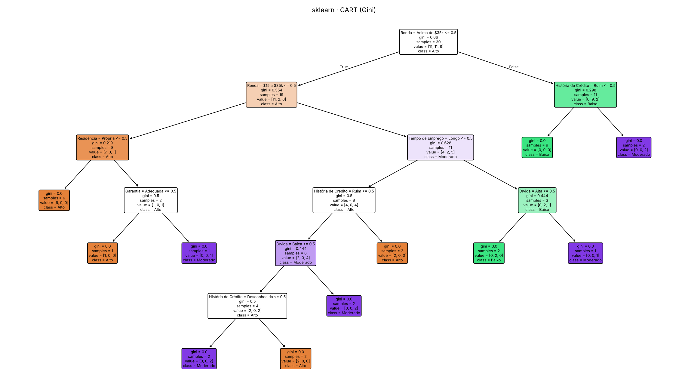
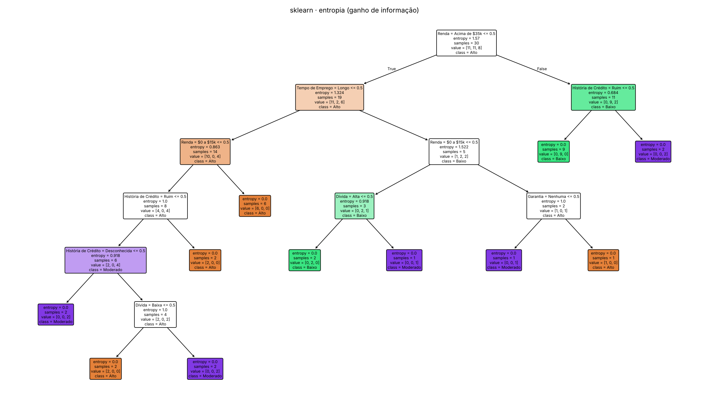
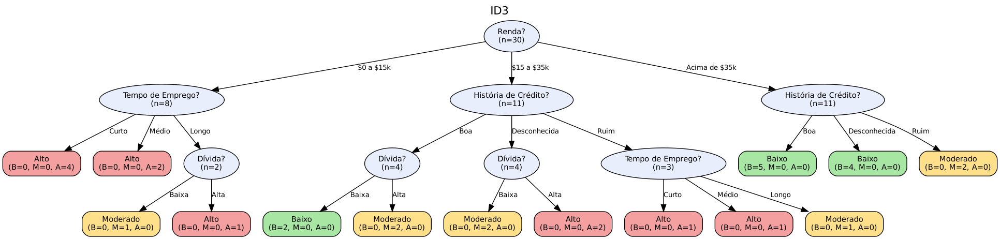
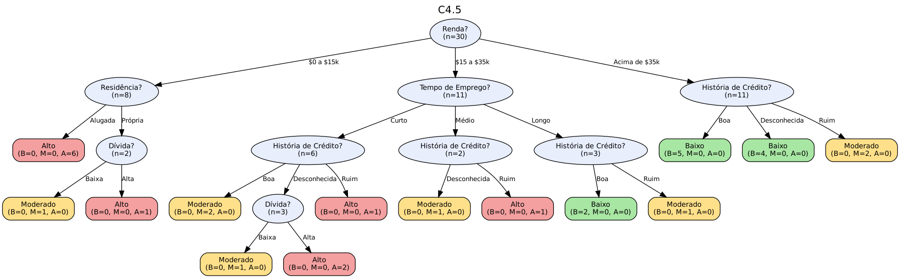

# Questão 2 — Árvores e regras com implementações de bibliotecas (ID3, C4.5 e CART)

> Mesma base ampliada da Questão 1 (30 exemplos, 6 atributos). Todos os números são gerados por
> `python -m q2.executar`; versão do scikit-learn usada: **1.9.1**.

## O que foi usado de cada algoritmo (transparência)

| Algoritmo | Como foi obtido nesta questão | Observação |
|---|---|---|
| **CART** | `sklearn.tree.DecisionTreeClassifier(criterion="gini")` | é o CART otimizado do scikit-learn; divide em *binário* sobre atributos codificados em one-hot (um valor contra os demais) |
| **ID3 (aprox.)** | `DecisionTreeClassifier(criterion="entropy")` | usa o **ganho de informação** do ID3, mas, no scikit-learn, as divisões continuam binárias (um valor vs. resto); não é o ID3 multivalorado |
| **ID3 e C4.5 "de verdade"** | pacote `ia` do repositório (`ia.arvores.construir`) | o scikit-learn **não** implementa ID3 nem C4.5 (razão de ganho, divisão multivalorada, poda pessimista). Weka/J48, R/C50 e `chefboost` não estavam disponíveis no ambiente em que o trabalho foi executado (sem acesso à rede para instalar), então usei a implementação própria, a mesma da Q1, chamada pela API |

Para quem quiser repetir com o **Weka (J48 = C4.5)**, a base foi exportada em ARFF:
[`dados/credito_ampliado.arff`](dados/credito_ampliado.arff) *(arquivo gerado por código; não pude executá-lo no Weka neste ambiente)*.

## Preparação dos dados para o scikit-learn

O scikit-learn só aceita atributos numéricos. Cada par *atributo = valor* virou uma coluna 0/1 (**one-hot**: 15
colunas), com domínios fixos para que o treino/teste usem sempre as mesmas colunas. Um teste do tipo
`Renda = Acima de $35k ≤ 0,5` significa "Renda ≠ Acima de $35k". Para apresentar as regras, essas condições são traduzidas de volta
para `atributo = valor` ou `atributo ∈ {...}` (os valores restantes após as exclusões). `random_state = 0` fixa o desempate
entre divisões de mesma qualidade (o scikit-learn sorteia a ordem dos atributos).

## Árvore 1 — CART (scikit-learn, Gini)



```
|--- Renda = Acima de $35k <= 0.50
|   |--- Renda = $15 a $35k <= 0.50
|   |   |--- Residência = Própria <= 0.50
|   |   |   |--- weights: [6.00, 0.00, 0.00] class: Alto
|   |   |--- Residência = Própria >  0.50
|   |   |   |--- Garantia = Adequada <= 0.50
|   |   |   |   |--- weights: [1.00, 0.00, 0.00] class: Alto
|   |   |   |--- Garantia = Adequada >  0.50
|   |   |   |   |--- weights: [0.00, 0.00, 1.00] class: Moderado
|   |--- Renda = $15 a $35k >  0.50
|   |   |--- Tempo de Emprego = Longo <= 0.50
|   |   |   |--- História de Crédito = Ruim <= 0.50
|   |   |   |   |--- Dívida = Baixa <= 0.50
|   |   |   |   |   |--- História de Crédito = Desconhecida <= 0.50
|   |   |   |   |   |   |--- weights: [0.00, 0.00, 2.00] class: Moderado
|   |   |   |   |   |--- História de Crédito = Desconhecida >  0.50
|   |   |   |   |   |   |--- weights: [2.00, 0.00, 0.00] class: Alto
|   |   |   |   |--- Dívida = Baixa >  0.50
|   |   |   |   |   |--- weights: [0.00, 0.00, 2.00] class: Moderado
|   |   |   |--- História de Crédito = Ruim >  0.50
|   |   |   |   |--- weights: [2.00, 0.00, 0.00] class: Alto
|   |   |--- Tempo de Emprego = Longo >  0.50
|   |   |   |--- Dívida = Alta <= 0.50
|   |   |   |   |--- weights: [0.00, 2.00, 0.00] class: Baixo
|   |   |   |--- Dívida = Alta >  0.50
|   |   |   |   |--- weights: [0.00, 0.00, 1.00] class: Moderado
|--- Renda = Acima de $35k >  0.50
|   |--- História de Crédito = Ruim <= 0.50
|   |   |--- weights: [0.00, 9.00, 0.00] class: Baixo
|   |--- História de Crédito = Ruim >  0.50
|   |   |--- weights: [0.00, 0.00, 2.00] class: Moderado
```

### Base de regras (CART / scikit-learn) — 11 regras

| Regra | SE ... ENTÃO ... | Cobertura | Confiança |
| --- | --- | --- | --- |
| R1 | SE Renda = $0 a $15k E Residência = Alugada ENTÃO Risco = Alto | 6 | 6/6 |
| R2 | SE Renda = $0 a $15k E Residência = Própria E Garantia = Nenhuma ENTÃO Risco = Alto | 1 | 1/1 |
| R3 | SE Renda = $0 a $15k E Residência = Própria E Garantia = Adequada ENTÃO Risco = Moderado | 1 | 1/1 |
| R4 | SE Renda = $15 a $35k E Tempo de Emprego ∈ {Curto, Médio} E História de Crédito = Boa E Dívida = Alta ENTÃO Risco = Moderado | 2 | 2/2 |
| R5 | SE Renda = $15 a $35k E Tempo de Emprego ∈ {Curto, Médio} E História de Crédito = Desconhecida E Dívida = Alta ENTÃO Risco = Alto | 2 | 2/2 |
| R6 | SE Renda = $15 a $35k E Tempo de Emprego ∈ {Curto, Médio} E História de Crédito ∈ {Boa, Desconhecida} E Dívida = Baixa ENTÃO Risco = Moderado | 2 | 2/2 |
| R7 | SE Renda = $15 a $35k E Tempo de Emprego ∈ {Curto, Médio} E História de Crédito = Ruim ENTÃO Risco = Alto | 2 | 2/2 |
| R8 | SE Renda = $15 a $35k E Tempo de Emprego = Longo E Dívida = Baixa ENTÃO Risco = Baixo | 2 | 2/2 |
| R9 | SE Renda = $15 a $35k E Tempo de Emprego = Longo E Dívida = Alta ENTÃO Risco = Moderado | 1 | 1/1 |
| R10 | SE Renda = Acima de $35k E História de Crédito ∈ {Boa, Desconhecida} ENTÃO Risco = Baixo | 9 | 9/9 |
| R11 | SE Renda = Acima de $35k E História de Crédito = Ruim ENTÃO Risco = Moderado | 2 | 2/2 |

## Árvore 2 — critério de entropia / ganho de informação (scikit-learn, "ID3 binário")



```
|--- Renda = Acima de $35k <= 0.50
|   |--- Tempo de Emprego = Longo <= 0.50
|   |   |--- Renda = $0 a $15k <= 0.50
|   |   |   |--- História de Crédito = Ruim <= 0.50
|   |   |   |   |--- História de Crédito = Desconhecida <= 0.50
|   |   |   |   |   |--- weights: [0.00, 0.00, 2.00] class: Moderado
|   |   |   |   |--- História de Crédito = Desconhecida >  0.50
|   |   |   |   |   |--- Dívida = Baixa <= 0.50
|   |   |   |   |   |   |--- weights: [2.00, 0.00, 0.00] class: Alto
|   |   |   |   |   |--- Dívida = Baixa >  0.50
|   |   |   |   |   |   |--- weights: [0.00, 0.00, 2.00] class: Moderado
|   |   |   |--- História de Crédito = Ruim >  0.50
|   |   |   |   |--- weights: [2.00, 0.00, 0.00] class: Alto
|   |   |--- Renda = $0 a $15k >  0.50
|   |   |   |--- weights: [6.00, 0.00, 0.00] class: Alto
|   |--- Tempo de Emprego = Longo >  0.50
|   |   |--- Renda = $0 a $15k <= 0.50
|   |   |   |--- Dívida = Alta <= 0.50
|   |   |   |   |--- weights: [0.00, 2.00, 0.00] class: Baixo
|   |   |   |--- Dívida = Alta >  0.50
|   |   |   |   |--- weights: [0.00, 0.00, 1.00] class: Moderado
|   |   |--- Renda = $0 a $15k >  0.50
|   |   |   |--- Garantia = Nenhuma <= 0.50
|   |   |   |   |--- weights: [0.00, 0.00, 1.00] class: Moderado
|   |   |   |--- Garantia = Nenhuma >  0.50
|   |   |   |   |--- weights: [1.00, 0.00, 0.00] class: Alto
|--- Renda = Acima de $35k >  0.50
|   |--- História de Crédito = Ruim <= 0.50
|   |   |--- weights: [0.00, 9.00, 0.00] class: Baixo
|   |--- História de Crédito = Ruim >  0.50
|   |   |--- weights: [0.00, 0.00, 2.00] class: Moderado
```

### Base de regras (entropia / scikit-learn) — 11 regras

| Regra | SE ... ENTÃO ... | Cobertura | Confiança |
| --- | --- | --- | --- |
| R1 | SE Renda = $15 a $35k E Tempo de Emprego ∈ {Curto, Médio} E História de Crédito = Boa ENTÃO Risco = Moderado | 2 | 2/2 |
| R2 | SE Renda = $15 a $35k E Tempo de Emprego ∈ {Curto, Médio} E História de Crédito = Desconhecida E Dívida = Alta ENTÃO Risco = Alto | 2 | 2/2 |
| R3 | SE Renda = $15 a $35k E Tempo de Emprego ∈ {Curto, Médio} E História de Crédito = Desconhecida E Dívida = Baixa ENTÃO Risco = Moderado | 2 | 2/2 |
| R4 | SE Renda = $15 a $35k E Tempo de Emprego ∈ {Curto, Médio} E História de Crédito = Ruim ENTÃO Risco = Alto | 2 | 2/2 |
| R5 | SE Renda = $0 a $15k E Tempo de Emprego ∈ {Curto, Médio} ENTÃO Risco = Alto | 6 | 6/6 |
| R6 | SE Renda = $15 a $35k E Tempo de Emprego = Longo E Dívida = Baixa ENTÃO Risco = Baixo | 2 | 2/2 |
| R7 | SE Renda = $15 a $35k E Tempo de Emprego = Longo E Dívida = Alta ENTÃO Risco = Moderado | 1 | 1/1 |
| R8 | SE Renda = $0 a $15k E Tempo de Emprego = Longo E Garantia = Adequada ENTÃO Risco = Moderado | 1 | 1/1 |
| R9 | SE Renda = $0 a $15k E Tempo de Emprego = Longo E Garantia = Nenhuma ENTÃO Risco = Alto | 1 | 1/1 |
| R10 | SE Renda = Acima de $35k E História de Crédito ∈ {Boa, Desconhecida} ENTÃO Risco = Baixo | 9 | 9/9 |
| R11 | SE Renda = Acima de $35k E História de Crédito = Ruim ENTÃO Risco = Moderado | 2 | 2/2 |

## Árvores 3 e 4 — ID3 e C4.5 (implementação própria, pacote `ia`)

O scikit-learn não tem ID3 nem C4.5; as árvores abaixo vêm de `ia.arvores.construir(base, "ID3")` e `construir(base, "C4.5")`
(o passo a passo completo dos cálculos está na Questão 1: [`passo_a_passo_id3.md`](../q1/resultados/passo_a_passo_id3.md) e
[`passo_a_passo_c45.md`](../q1/resultados/passo_a_passo_c45.md)).

### ID3 — 14 regras



| Regra | SE ... ENTÃO ... | Cobertura | Confiança |
| --- | --- | --- | --- |
| R1 | SE Renda = $0 a $15k E Tempo de Emprego = Curto ENTÃO Risco = Alto | 4 | 4/4 |
| R2 | SE Renda = $0 a $15k E Tempo de Emprego = Médio ENTÃO Risco = Alto | 2 | 2/2 |
| R3 | SE Renda = $0 a $15k E Tempo de Emprego = Longo E Dívida = Baixa ENTÃO Risco = Moderado | 1 | 1/1 |
| R4 | SE Renda = $0 a $15k E Tempo de Emprego = Longo E Dívida = Alta ENTÃO Risco = Alto | 1 | 1/1 |
| R5 | SE Renda = $15 a $35k E História de Crédito = Boa E Dívida = Baixa ENTÃO Risco = Baixo | 2 | 2/2 |
| R6 | SE Renda = $15 a $35k E História de Crédito = Boa E Dívida = Alta ENTÃO Risco = Moderado | 2 | 2/2 |
| R7 | SE Renda = $15 a $35k E História de Crédito = Desconhecida E Dívida = Baixa ENTÃO Risco = Moderado | 2 | 2/2 |
| R8 | SE Renda = $15 a $35k E História de Crédito = Desconhecida E Dívida = Alta ENTÃO Risco = Alto | 2 | 2/2 |
| R9 | SE Renda = $15 a $35k E História de Crédito = Ruim E Tempo de Emprego = Curto ENTÃO Risco = Alto | 1 | 1/1 |
| R10 | SE Renda = $15 a $35k E História de Crédito = Ruim E Tempo de Emprego = Médio ENTÃO Risco = Alto | 1 | 1/1 |
| R11 | SE Renda = $15 a $35k E História de Crédito = Ruim E Tempo de Emprego = Longo ENTÃO Risco = Moderado | 1 | 1/1 |
| R12 | SE Renda = Acima de $35k E História de Crédito = Boa ENTÃO Risco = Baixo | 5 | 5/5 |
| R13 | SE Renda = Acima de $35k E História de Crédito = Desconhecida ENTÃO Risco = Baixo | 4 | 4/4 |
| R14 | SE Renda = Acima de $35k E História de Crédito = Ruim ENTÃO Risco = Moderado | 2 | 2/2 |

### C4.5 (razão de ganho) — 14 regras



| Regra | SE ... ENTÃO ... | Cobertura | Confiança |
| --- | --- | --- | --- |
| R1 | SE Renda = $0 a $15k E Residência = Alugada ENTÃO Risco = Alto | 6 | 6/6 |
| R2 | SE Renda = $0 a $15k E Residência = Própria E Dívida = Baixa ENTÃO Risco = Moderado | 1 | 1/1 |
| R3 | SE Renda = $0 a $15k E Residência = Própria E Dívida = Alta ENTÃO Risco = Alto | 1 | 1/1 |
| R4 | SE Renda = $15 a $35k E Tempo de Emprego = Curto E História de Crédito = Boa ENTÃO Risco = Moderado | 2 | 2/2 |
| R5 | SE Renda = $15 a $35k E Tempo de Emprego = Curto E História de Crédito = Desconhecida E Dívida = Baixa ENTÃO Risco = Moderado | 1 | 1/1 |
| R6 | SE Renda = $15 a $35k E Tempo de Emprego = Curto E História de Crédito = Desconhecida E Dívida = Alta ENTÃO Risco = Alto | 2 | 2/2 |
| R7 | SE Renda = $15 a $35k E Tempo de Emprego = Curto E História de Crédito = Ruim ENTÃO Risco = Alto | 1 | 1/1 |
| R8 | SE Renda = $15 a $35k E Tempo de Emprego = Médio E História de Crédito = Desconhecida ENTÃO Risco = Moderado | 1 | 1/1 |
| R9 | SE Renda = $15 a $35k E Tempo de Emprego = Médio E História de Crédito = Ruim ENTÃO Risco = Alto | 1 | 1/1 |
| R10 | SE Renda = $15 a $35k E Tempo de Emprego = Longo E História de Crédito = Boa ENTÃO Risco = Baixo | 2 | 2/2 |
| R11 | SE Renda = $15 a $35k E Tempo de Emprego = Longo E História de Crédito = Ruim ENTÃO Risco = Moderado | 1 | 1/1 |
| R12 | SE Renda = Acima de $35k E História de Crédito = Boa ENTÃO Risco = Baixo | 5 | 5/5 |
| R13 | SE Renda = Acima de $35k E História de Crédito = Desconhecida ENTÃO Risco = Baixo | 4 | 4/4 |
| R14 | SE Renda = Acima de $35k E História de Crédito = Ruim ENTÃO Risco = Moderado | 2 | 2/2 |

Após a poda pessimista, o C4.5 fica com 12 regras ([`regras_c45_podada.md`](../q1/resultados/regras_c45_podada.md)).

## Verificação cruzada: as escolhas do scikit-learn conferem com as fórmulas do pacote `ia`?

Recalculei, com as funções `gini` e `entropia` do pacote `ia`, todas as divisões binárias "atributo = valor vs. resto" da raiz.
As melhores divisões foram:

| Divisão binária (atributo = valor vs. resto) | Gini ponderado | Ganho de informação |
| --- | --- | --- |
| Renda = Acima de $35k | 0,4600 | 0,4809 |
| Renda = $0 a $15k | 0,5098 | 0,3449 |
| Tempo de Emprego = Curto | 0,5738 | 0,1857 |
| História de Crédito = Ruim | 0,5826 | 0,2176 |
| Residência = Alugada | 0,5935 | 0,1447 |
| Residência = Própria | 0,5935 | 0,1447 |

* Raiz do CART do scikit-learn: **Renda = Acima de $35k** — é a divisão de menor Gini ponderado.
* Raiz da árvore por entropia: **Renda = Acima de $35k** — é a divisão de maior ganho de informação.
* O CART próprio da Q1 (que testa subconjuntos de valores) escolheu na raiz **Renda ∈ {$0 a $15k, $15 a $35k}** vs. o resto, que é a **mesma partição**
  de "Renda = Acima de $35k vs. resto": as duas implementações concordam na raiz.

## Comparação

| Modelo | Origem | Folhas | Prof. | Treino | LOO | CV 5-fold ×20 |
| --- | --- | --- | --- | --- | --- | --- |
| sklearn · CART (Gini) | biblioteca (scikit-learn) | 11 | 6 | 100,0% | 70,0% | 67,0% ± 8,2% |
| sklearn · entropia (ganho de informação) | biblioteca (scikit-learn) | 11 | 6 | 100,0% | 66,7% | 65,8% ± 8,5% |
| ia · ID3 | implementação própria (pacote `ia`) | 14 | 3 | 100,0% | 80,0% | 77,0% ± 8,4% |
| ia · C4.5 | implementação própria (pacote `ia`) | 14 | 4 | 100,0% | 70,0% | 71,7% ± 8,3% |
| ia · C4.5 podada | implementação própria (pacote `ia`) | 12 | 4 | 96,7% | 63,3% | 65,3% ± 8,0% |
| ia · CART | implementação própria (pacote `ia`) | 11 | 6 | 100,0% | 73,3% | 69,7% ± 9,4% |

Concordância das previsões com os modelos do scikit-learn, nas 216 combinações possíveis de atributos:

| Par de modelos | Concordância (216 combinações) |
| --- | --- |
| sklearn · CART (Gini) × sklearn · entropia (ganho de informação) | 91,7% |
| sklearn · CART (Gini) × ia · ID3 | 79,6% |
| sklearn · CART (Gini) × ia · C4.5 | 80,6% |
| sklearn · CART (Gini) × ia · C4.5 podada | 80,6% |
| sklearn · CART (Gini) × ia · CART | 83,3% |
| sklearn · entropia (ganho de informação) × ia · ID3 | 85,2% |
| sklearn · entropia (ganho de informação) × ia · C4.5 | 77,8% |
| sklearn · entropia (ganho de informação) × ia · C4.5 podada | 83,3% |
| sklearn · entropia (ganho de informação) × ia · CART | 88,9% |

### Análise

1. **Árvores binárias do scikit-learn são mais profundas.** Com um-valor-contra-resto, atributos de 3 valores exigem vários
   testes encadeados: profundidade 6 (CART) e 6 (entropia), contra 3 no ID3 multivalorado — o que significa
   mais perguntas por consulta em um sistema especialista.
2. **Gini × entropia dão árvores quase iguais** (11 e 11 folhas; mesma raiz). A diferença está nos desempates
   entre divisões de mesma qualidade, controlados por `random_state`.
3. **Generalização.** Nesta base pequena, o ID3 multivalorado teve a melhor estimativa (CV 77,0%) contra
   67,0% (CART sklearn) e 65,8% (entropia sklearn); com desvio-padrão em torno de 8 pontos percentuais, as diferenças
   são modestas e devem ser lidas como indicativas (ver Q1, análise de sensibilidade).
4. **CART próprio × scikit-learn.** O CART próprio (subconjuntos de valores) e o do scikit-learn (um-contra-resto) têm o mesmo número de folhas
   (11 e 11) e desempenho semelhante (CV 69,7% e 67,0%); a busca em subconjuntos é mais
   expressiva, mas aqui não mudou o resultado de forma relevante.

## Poda por custo-complexidade (CART do scikit-learn)

O scikit-learn oferece a poda do CART por custo-complexidade (`ccp_alpha`). A tabela mostra o caminho de poda do CART nesta base
(*sem* escolher o melhor alfa pela própria CV, o que seria otimista):

| ccp_alpha | Folhas | Acurácia no treino | LOO | CV 5-fold ×20 |
| --- | --- | --- | --- | --- |
| 0,00000 | 11 | 100,0% | 70,0% | 67,0% ± 8,2% |
| 0,02917 | 9 | 96,7% | 66,7% | 66,5% ± 8,4% |
| 0,04444 | 6 | 86,7% | 53,3% | 62,3% ± 7,4% |
| 0,04444 | 5 | 80,0% | 53,3% | 62,3% ± 7,4% |
| 0,05253 | 4 | 76,7% | 53,3% | 60,2% ± 6,8% |
| 0,06224 | 3 | 73,3% | 46,7% | 59,2% ± 6,0% |
| 0,10909 | 2 | 66,7% | 66,7% | 59,8% ± 5,3% |
| 0,20003 | 1 | 36,7% | 0,0% | 47,2% ± 4,0% |

Aumentar `ccp_alpha` reduz folhas e acurácia de treino; a acurácia de validação **não melhora** em nenhum ponto da trilha, coerente com a Q1:
a base é pequena e sem ruído, e podar descarta casos legítimos.

## Reprodução

```bash
python -m q2.executar
```
